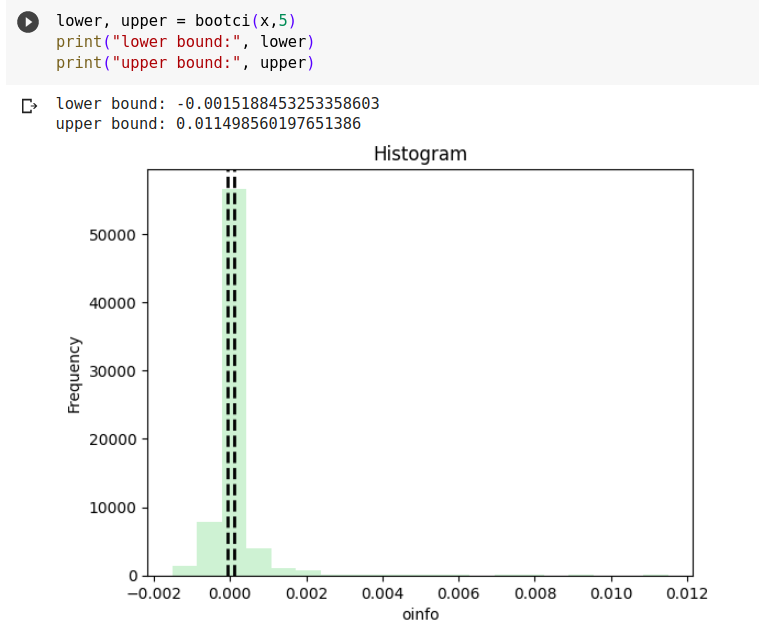

### - Resampling the Input Data
To perform bootstrapping, we need to resample the input data. This involves randomly sampling data points from the 
original dataset with replacement. Each resampled dataset should have the same length as the original dataset and 
values can be repeated within.

### - Selecting Significant Multiplets 
Once we have resampled datasets, we can compute the desired metric, o-information on each resampled dataset. This 
step allows us to evaluate the metric's value on different subsets of the original data.

### - Compute Confidence Intervals
With the resampled metric values, we can estimate confidence intervals to quantify the uncertainty associated with 
the metric. One common approach is to calculate the percentiles of the resampled metric values. For example, computing 
the 5th and 95th percentiles will give a 90% confidence interval. These percentiles represent the lower and upper 
bounds of the confidence interval, respectively.

### Code for bootci
#### Step-by-step explanation of the code
1. Generating all possible combinations of given size of multiplets
   
```
for msize in range(minsize, maxsize + 1):
    # generate combinations
    n_features=x.shape[1]
    combs = combinations(n_features+1, msize)
```

2. Resampling input x for each combination nboot times <br>
   eg. x = [1,2,3] <br>
   resampled_x = [1, 2 ,1] , [3, 3, 1] , etc
   
```
for i in range(n_boots):
      part = resample(x.T, n_samples=x.shape[2], random_state=0 + i).T ## reshaping of x : make correction (transpose)

```

3. Calculate the oinfo using the resampled part for each combination and keep appending the value of oinfo to a list
   
```
      # copnorm and demean the resampled partition
      part = copnorm_nd(part.copy(), axis=0)
      part = part - part.mean(axis=0, keepdims=True)

      # make the data (n_variables, n_features, n_trials)
      part = jnp.asarray(part.transpose(2, 1, 0))

      # calcualte oinfo
      # print(part.shape)
      _, _oinfo = jax.lax.scan(oinfo_mmult,part, combs)

      flattened_list = list(itertools.chain.from_iterable(np.asarray(_oinfo)))
      val.extend(flattened_list)
```

4. Calculating the 5th and 95th percentile of the oinfo and plotting the results.
   
```
    ci = np.stack(val,axis=0)
    # oinfo values within [0.05, 0.95] of bounds
    p5 = np.nanpercentile(ci, 5, axis=0)
    p95 = np.nanpercentile(ci, 95, axis=0)
    filtered_data = [x for x in ci if p5 <= x <= p95]
    final.extend(filtered_data)
  # Plotting the histogram
  plt.hist(final, bins=20, color='C2', alpha=.2)
  plt.xlabel('oinfo')
  plt.ylabel('Frequency')
  plt.title('Histogram')

  # Marking the 25th and 75th percentile
  plt.axvline(np.nanpercentile(final, 25), color='k', lw=2, ls='--')
  plt.axvline(np.nanpercentile(final, 75), color='k', lw=2, ls='--')
  return p5, p95
```

### Complete code as a function `bootci`

```
def bootci(x, n_boots):
  minsize = 3
  maxsize=5
  oinfo,ci=[],[]
  final = []
  val=[]
  for msize in range(minsize, maxsize + 1):
    n_features=x.shape[1]
    combs = combinations(n_features+1, msize)
    for i in range(n_boots):
      part = resample(x.T, n_samples=x.shape[2], random_state=0 + i).T ## reshaping of x : make correction (transpose)

      part = copnorm_nd(part.copy(), axis=0)
      part = part - part.mean(axis=0, keepdims=True)

      part = jnp.asarray(part.transpose(2, 1, 0))

      _, _oinfo = jax.lax.scan(oinfo_mmult,part, combs)
      flattened_list = list(itertools.chain.from_iterable(np.asarray(_oinfo)))
      val.extend(flattened_list)

    ci = np.stack(val,axis=0)
    p5 = np.nanpercentile(ci, 5, axis=0)
    p95 = np.nanpercentile(ci, 95, axis=0)
    filtered_data = [x for x in ci if p5 <= x <= p95]
    final.extend(filtered_data)

  # Plotting the histogram
  plt.hist(final, bins=20, color='C2', alpha=.2)
  plt.xlabel('oinfo')
  plt.ylabel('Frequency')
  plt.title('Histogram')
  plt.axvline(np.nanpercentile(final, 25), color='k', lw=2, ls='--')
  plt.axvline(np.nanpercentile(final, 75), color='k', lw=2, ls='--')
  return p5, p95
```

### Confidence Interval Plotted by the function


Here, the `number of times a particular oinfo value occurs (frequency of oinfo)` is plotted against the `oinfo`. The black dotted plots are the `p5` (5th percentile) and `p95` (95th percentile) of the values of oinfo. These give a 90% confidence interval of the oinfo range.
