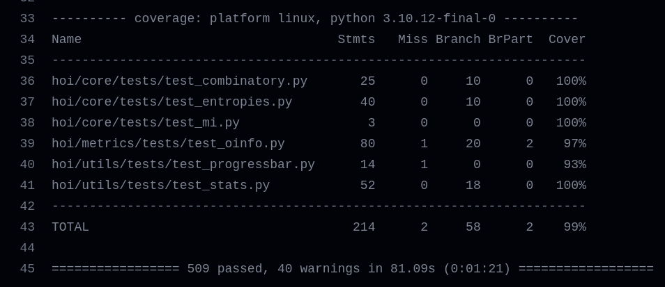

Maintaining code quality is a cornerstone of software development that not only ensures functionality but also facilitates collaboration and longevity. In this blog post, we'll delve into two essential practices that contribute to robust code: smoke testing and code formatting. These practices not only enhance code reliability but also streamline development processes and foster a healthier codebase.

### Crafting Reliable Foundations with Smoke Testing
Writing code is just the beginning; ensuring that it works as intended is where the real value lies.
Smoke testing, a practice that involves running quick, high-level tests on functions, is a crucial step in this direction.
Here's an exploration of how we've integrated smoke testing into our workflow:
- Function Selection: We began by identifying key functions within our codebase that serve as the backbone of various features.
- Test Suite Creation: For each function, we created a set of smoke tests that encompass essential use cases.
These tests serve as a quick indicator of whether the function is fundamentally working.
- Automation Integration: Our continuous integration (CI) pipeline was updated to include these smoke tests.
This ensures that any changes to the codebase trigger smoke tests automatically, preventing regressions from slipping through.

##### We have used [pytest](https://docs.pytest.org/en/7.4.x/) to write unit tests.
### An example
Consider the function `ctransform()`

```
def ctransform(x):
    """Copula transformation (empirical CDF).

    Parameters
    ----------
    x : array_like
        Array of data. The trial axis should be the last one

    Returns
    -------
    xr : array_like
        Empirical CDF value along the last axis of x.
    """
    xr = np.argsort(np.argsort(x)).astype(float)
    xr += 1.0
    xr /= float(xr.shape[-1] + 1)
    return xr
```
The tests written for this function should check the following:
- The return type of the function for every valid input is an array
- It must have the same shape as of the input `x`
- All the values in the output must lie within the range [0,1].

The unit test for the same is:

```
@pytest.mark.parametrize("x", [x1, x2])
def test_ctransform(x):
    xr = ctransform(x)
    assert isinstance(xr, np.ndarray)
    assert xr.shape == x.shape
    for row in xr:
        for cdf in row:
            assert cdf >= 0 and cdf <= 1
```
### Code coverage
Diving deeper into our quest for excellence and quality assurance, we used [codecov](https://about.codecov.io/) to obtain the extent to which our unit tests explore our codebase. 
##### Reports generated by codecov


## Code quality
Consistent code formatting is more than just aesthetics; it enhances readability, reduces errors, and fosters a cohesive codebase.
We've taken the extra step of adopting the popular code formatter, Black, to ensure a consistent style throughout our code.
Here's how we achieved this:
- Adopting Black: We introduced Black, an opinionated code formatter, to our project. It allows us to adhere to a standardized formatting style effortlessly.
- Configuration and Integration: We configured our CI pipeline to automatically check if the code adheres to the Black formatting style.
This enforces code uniformity and minimizes style-related code reviews.
